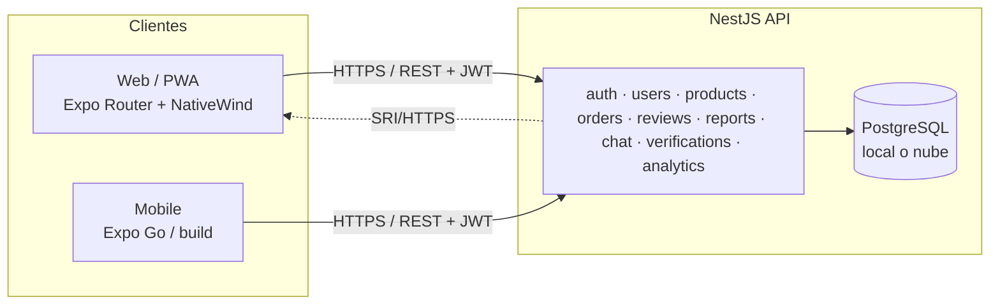
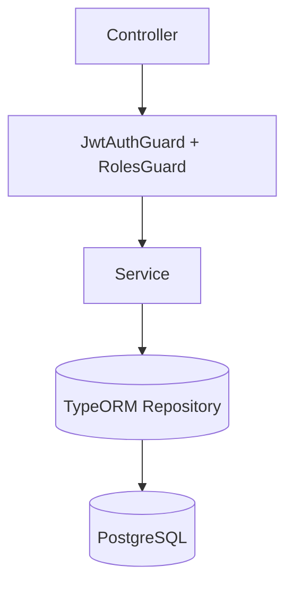

# Arquitectura — ERS / TechShield

Marketplace verificado de hardware y móviles: compra/venta con custodia (escrow), auditoría técnica, reseñas y analytics.

## Vista general



## Backend (NestJS)



- **Auth**: `access` JWT (15m) + `refresh` JWT (30d) rotado y revocado (`refresh_tokens`, hash sha256). `JwtStrategy` valida usuario activo.
- **Roles**: `buyer` / `seller` / `admin`.
  - `seller` gestiona **su propio catálogo** (crear/editar/eliminar). `admin` puede todo.
  - `admin` resuelve quejas (`reviews/:id/resolve`), verifica productos (`verifications`) y modera reportes.
- **Custodia**: `orders` (in_custody → shipped → delivered), devolución (10 días) y cobertura (45 días).
- **Rate limit**: `ThrottlerGuard` global, clave por `user.id` (o IP).
- **Logging**: middleware de requests (método, ruta, status, ms).

### Enriquecimiento de productos
`findAll` aplica un **fast path** de paginación en SQL (`skip/take/getManyAndCount`) cuando no hay filtros dependientes de JS; si se usan `minPositivity`, `sellerTier`, quejas o precio sospechoso, filtra en memoria tras el enriquecimiento.

## Frontend (Expo Router)

```mermaid
flowchart LR
  Layout[_layout.tsx] --> Providers[Theme + Auth + Marketplace]
  Providers --> Stack[Stack de rutas]
  Stack --> S[index · login · register · filters · product/[id] · inspection · publish · profile · analytics]
```

- **Estado**: `AuthContext` (sesión + refresh), `MarketplaceContext` (filtros + resultados cacheados), `ThemeContext` (light/dark/system) e `I18nProvider`.
- **Tema**: paleta por CSS variables (`:root` claro, `.dark` oscuro) con tokens semánticos.
- **Web**: SSG (`web.output: static`), code-splitting (`asyncRoutes`), PWA (manifest + service worker) y **SRI** en los assets (`scripts/add-sri.js`).
- **API**: `api.ts` reintenta automáticamente con refresh ante 401.

## Estructura

```
backend/   NestJS (src/<módulo>/{controller,service,entity,dto})
Frontend/  Expo Router (src/app rutas, src/screens, src/components, src/context)
Docs/      Documentación
.github/   CI (ci.yml backend, web.yml frontend+deploy)
```
